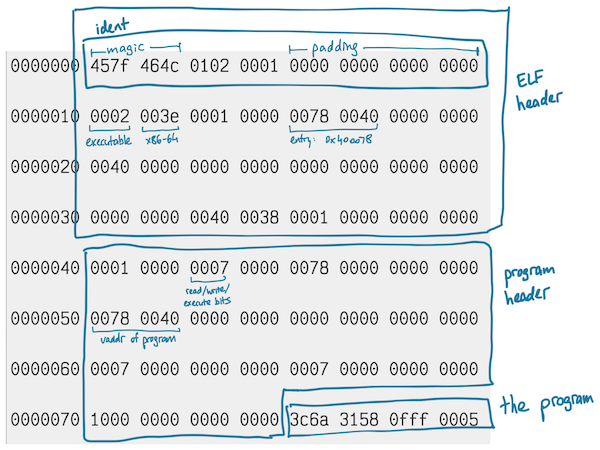

# Creating a minimal ELF-64 file

[](https://github.com/tchajed/minimal-elf/actions/workflows/build.yml)

I wanted to create an executable that doesn't issue any syscalls (or at least as
few as possible). That
turned into creating a minimal binary, which led to this [blog
post](https://www.muppetlabs.com/~breadbox/software/tiny/teensy.html).
Unfortunately the post creates a 32-bit ELF file, and it would be nicer to use
64-bit. I also wanted to write it in Rust (to learn some Rust, not because this
is a good idea).

There are three stages of minimization here: `tiny.c`, `tiny.s`, and then a Rust
program that generates a binary directly.

## C

```c
int main() { return 0; }
```

There's not much to do in C, but the binary it generates is a whopping 20KB:

```sh
.rwxr-xr-x 20,344 tchajed 31 May 16:25 tiny_c
```

While C is certainly a low-level language, it does have a runtime surrounding
this code. Running `objdump -d tiny_c` reveals a whole bunch of functionality
surrounding our pithy function (which is just `xor %eax, %eax; ret`). In
particular libc provides a function `_start`, which is the actual entry point of
the file. The libc `_start` does a bunch of stuff I don't understand, including
setting up stack guards and some global initialization.

## Assembly

We can try to create a more minimal binary with the following:

```asm
// tiny_bad.s
.globl _start
.text
_start:
  xor %eax, %eax
  ret
```

```txt
$ clang tiny_bad.s -o tiny_bad
/usr/bin/ld: /tmp/tiny_bad-a4cf26.o: in function `_start':
(.text+0x0): multiple definition of `_start'; /usr/bin/../lib64/gcc/x86_64-pc-linux-gnu/12.1.0/../../../../lib64/Scrt1.o:/build/glibc/src/glibc/csu/../sysdeps/x86_64/start.S:57: first defined here
/usr/bin/ld: /usr/bin/../lib64/gcc/x86_64-pc-linux-gnu/12.1.0/../../../../lib64/Scrt1.o: in function `_start':
/build/glibc/src/glibc/csu/../sysdeps/x86_64/start.S:103: undefined reference to `main'
```

Oops, the linker says there's already a `_start` and no `main`. We need to disable some
stuff provided by C; first we don't need a `_start`, we'll take care of it:

```sh
$ clang -nostdlib tiny_bad.s -o tiny_bad
$ ./tiny_bad
fish: Job 1, './tiny_bad' terminated by signal SIGSEGV (Address boundary error)
```

Oops, that doesn't look good. It turns out that one useful thing libc does for
us is to take the _return value_ from `main` (in the sense of the C calling
convention) into a call to the `exit(2)` system call to terminate the process.
Our little program calls `ret`, but there's no function to return from yet!
Instead, we should just call `exit(2)` directly. This [blog post on assembly for
Linux](https://www.cs.fsu.edu/~langley/CNT5605/2017-Summer/assembly-example/assembly.html)
was helpful, though it's nice to note that it's just walking through the Linux
source code. This is also where we depart from the blog post above, because
making a 64-bit syscall is a bit different: we put the syscall number (60) in
%rax and the argument to the syscall (the return value, in this case) in %edi:

```asm
// tiny.s
.globl _start
.text
_start:
  mov $60, %rax
  xorl %edi, %edi
  syscall
```

```
$ clang -nostdlib tiny.s -o tiny
$ ll tiny
.rwxr-xr-x 13,320 tchajed 31 May 16:59 tiny
$ ./tiny
```

Ok, so this works but the file is still 13KB. In fact, the binary is still doing
a bunch of other stuff:

```
$ strace ./tiny
execve("./tiny", ["./tiny"], 0x7ffd64a82ba0 /* 26 vars */) = 0
brk(NULL)                               = 0x56523aabb000
arch_prctl(0x3001 /* ARCH_??? */, 0x7fff8f6fff80) = -1 EINVAL (Invalid argument)
access("/etc/ld.so.preload", R_OK)      = -1 ENOENT (No such file or directory)
mmap(NULL, 8192, PROT_READ|PROT_WRITE, MAP_PRIVATE|MAP_ANONYMOUS, -1, 0) = 0x7f2fb1376000
arch_prctl(ARCH_SET_FS, 0x7f2fb1376a80) = 0
set_tid_address(0x7f2fb1376d50)         = 44395
set_robust_list(0x7f2fb1376d60, 24)     = 0
rseq(0x7f2fb1377420, 0x20, 0, 0x53053053) = 0
mprotect(0x56523a375000, 4096, PROT_READ) = 0
exit(0)                                 = ?
+++ exited with 0 +++
```

This is actually coming from dynamic linking. We don't have any symbols to
dynamically link (in fact we only have one symbol, `_start`, which doesn't even
attempt to follow the C calling convention). Let's instead link the program
statically:

```
$ clang -nostdlib -static tiny.s -o tiny
$ ./tiny
.rwxr-xr-x 4,608 tchajed 31 May 16:58 tiny
$ strace ./tiny
execve("./tiny", ["./tiny"], 0x7ffe41ada7d0 /* 26 vars */) = 0
exit(0)                                 = ?
+++ exited with 0 +++
```

Great, we're down to 4.6KB. The file [tiny.s](tiny.s) makes one change:
instead of doing `mov %60, %rax` like a normal person, we use `push` and `pop`
since these [take only 3 bytes instead of
4](https://stackoverflow.com/questions/33825546/shortest-intel-x86-64-opcode-for-rax-1).
The Makefile also calls `strip` to get rid of some unnecessary sections in the
binary with symbols.

## Manually writing a binary

The binary produced by using the normal assembler still has a lot of cruft:

```
$ objdump -x tiny_asm
tiny_asm:     file format elf64-x86-64
tiny_asm
architecture: i386:x86-64, flags 0x00000102:
EXEC_P, D_PAGED
start address 0x0000000000401000

Program Header:
    LOAD off    0x0000000000000000 vaddr 0x0000000000400000 paddr 0x0000000000400000 align 2**12
         filesz 0x00000000000000b0 memsz 0x00000000000000b0 flags r--
    LOAD off    0x0000000000001000 vaddr 0x0000000000401000 paddr 0x0000000000401000 align 2**12
         filesz 0x0000000000000007 memsz 0x0000000000000007 flags r-x

Sections:
Idx Name          Size      VMA               LMA               File off  Algn
  0 .text         00000007  0000000000401000  0000000000401000  00001000  2**2
                  CONTENTS, ALLOC, LOAD, READONLY, CODE
SYMBOL TABLE:
no symbols
```

This is after `strip` - you can see there's two segments (only the onye at vaddr
0x401000 has the program, so we don't need the other one), a .text section, and
a symbol table which turns out to be encoded as an empty section. We can get
more detailed information as to what is actually in this file using `readelf`:

```
$ readelf -lSW tiny_asm
There are 3 section headers, starting at offset 0x1018:

Section Headers:
  [Nr] Name              Type            Address          Off    Size   ES Flg Lk Inf Al
  [ 0]                   NULL            0000000000000000 000000 000000 00      0   0  0
  [ 1] .text             PROGBITS        0000000000401000 001000 000007 00  AX  0   0  4
  [ 2] .shstrtab         STRTAB          0000000000000000 001007 000011 00      0   0  1
Key to Flags:
  W (write), A (alloc), X (execute), M (merge), S (strings), I (info),
  L (link order), O (extra OS processing required), G (group), T (TLS),
  C (compressed), x (unknown), o (OS specific), E (exclude),
  D (mbind), l (large), p (processor specific)

Elf file type is EXEC (Executable file)
Entry point 0x401000
There are 2 program headers, starting at offset 64

Program Headers:
  Type           Offset   VirtAddr           PhysAddr           FileSiz  MemSiz   Flg Align
  LOAD           0x000000 0x0000000000400000 0x0000000000400000 0x0000b0 0x0000b0 R   0x1000
  LOAD           0x001000 0x0000000000401000 0x0000000000401000 0x000007 0x000007 R E 0x1000

 Section to Segment mapping:
  Segment Sections...
   00
   01     .text
```

To really optimize the binary, we can instead produce an ELF file completely
manually. This is where [this Rust program](src/lib.rs) comes in. It constructs an
ELF binary by defining the appropriate binary structs and then writing them out,
using
[binary_layout](https://docs.rs/binary-layout/latest/binary_layout/index.html).
It even constructs the assembly code using
[iced-x86](https://docs.rs/iced-x86/latest/iced_x86/index.html), a remarkable
library for parsing and assembling x86 using Rust builders (not even macros!).

The ELF format has a program header followed by some number of section headers.
To optimize for space, our ELF file only uses a single program header and no
section headers (unlike the above file which has three sections; one is of size 0
and the other is an empty symbol table).

The result is a remarkably small file:

```
$ cargo run
$ ./tiny
$ ll tiny
.rwxr-xr-x 127 tchajed 31 May 17:04 tiny
```

Just 127 bytes! And we wrote all of them manually. Except for the 7-byte
program `push` (remember that?), which looks like this (from `objdump -d`):

```
  401000:	6a 3c                	push   $0x3c
  401002:	58                   	pop    %rax
  401003:	31 ff                	xor    %edi,%edi
  401005:	0f 05                	syscall
```

Here's a hand-made diagram of the file:


